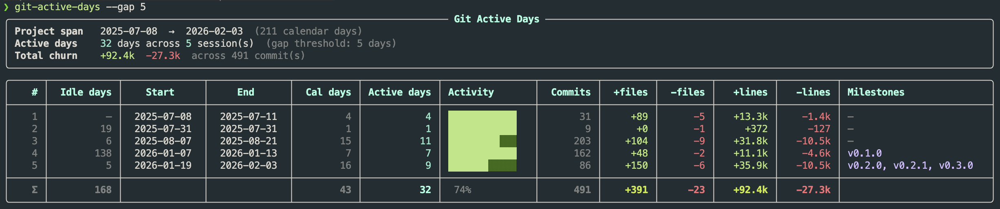

# git-active-days

Estimates how long you actively worked on a project by analyzing git commit history. Groups commit days into "sessions" separated by a configurable gap threshold, then tallies active days while ignoring dead time.



## Installation

```bash
uv tool install git+https://github.com/haffinnih/git-active-days
```

## Usage

```bash
# Run from inside any git repo
git-active-days

# Specify a repo path
git-active-days /path/to/repo

# Custom session gap threshold (default: 7 days)
git-active-days --gap 14

# Analyze a specific branch
git-active-days --branch main

# Filter by author
git-active-days --author "Habib"

# Analyze all branches
git-active-days --all-branches

# Show individual active dates per session
git-active-days --dates
```

## Shell completion

After installing, enable autocomplete for your shell:

```
git-active-days --install-completion
```

Then restart your shell (or source your rc file) for it to take effect.

## How it works

Commit dates are collected from `git log` and grouped into sessions. A new session starts when the gap between two consecutive active days exceeds the threshold (`--gap`, default 7 days). Each session reports its date range, active days, commit count, line churn, and any tags that fall within it.

## License

[MIT](./LICENSE)
